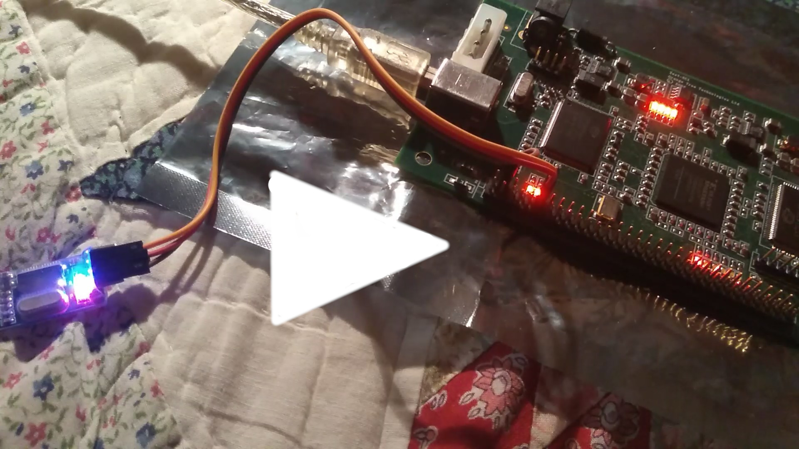

# grlib-gpl

Based on Jiri-Gaisler's fork of GRLIB GPL, this is an extremely optimistic
attempt from a SW developer to create a LEON3 inside his FPGA board (ZestSC1).

Previous (successful) attempts at programming said board are [here](https://github.com/ttsiodras/MandelbrotInVHDL/).

**UPDATE**: Attempt failed - the design can't fit in my FPGA board :-(

```
  The Slice Logic Distribution report is not meaningful if the design is
  over-mapped for a non-slice resource or if Placement fails.

  Number of bonded IOBs:                192 out of     173  110% (OVERMAPPED)
    IOB Flip Flops:                      85
  Number of RAMB16s:                     17 out of      24   70%
  Number of MULT18X18s:                   1 out of      24    4%
  Number of BUFGMUXs:                     5 out of       8   62%
  Number of DCMs:                         4 out of       4  100%
  Number of BSCANs:                       1 out of       1  100%

  Average Fanout of Non-Clock Nets:                3.57
```

(sigh)

I guess I'll try again at some point in the future, with a Leon2 - or a RISC-V Lite.

**UPDATE**: Setting `CFG_GRGPIO_ENABLE` to 0 (disabling Leon's GPIO) dropped the IOBs
to 174. I am just over the limit of 173 - ARGH.

**UPDATE**: I get it now - the IOBs are exhausted because of "ghost" IO entries for
the 'data' bus. Me=idiot - all this time I thought the leon3mp component's 
memory-related signals were something the 'daddy' component would connect;
instead, these are meant to be connected over the UCF file. Kind of violating
the SW engineer's principles here - "global" (.ucf-based) connections instead of
letting the user of `leon3mp` decide how to connect things.

That's my excuse, anyway :-)

Time to properly connect my SRAM. Feeling optimistic.

**UPDATE**: Slight detour: Waiting for a complete S/P/R every time I want to try
something is not an option... I need to set a proper simulation-first workflow.
But when I tried `make ghdl`...  it failed for the `unisim` parts - somehow,
the generated `make.ghdl` is missing their processing.

After a lot of huffing and puffing, I managed to fix this - by patching the
`make.ghdl` file that Jiri's scripts create, to delegate the `unisim` parts to a
[smaller Makefile of my own](designs/leon3-minimal/make.unisim).
That one processes VHDL files from the ISE's `src` folder, as well as the
`libraries` folder of GHDL (which was added as a submodule to this repo).

And indeed, I can now simulate one of the Spartan3 samples:

    $ cd designs/leon3-digilent-xc3s1000
    $ make -f Makefile.ttsiod-ghdl
    ...
    ./testbench --assert-level=error --ieee-asserts=disable
    LEON3 Digilent XC3S1000 Demonstration design
    GRLIB Version 2017.3.0, build 4208
    Target technology: spartan3  , memory library: spartan3  
    ahbctrl: AHB arbiter/multiplexer rev 1
    ahbctrl: Common I/O area disabled
    ahbctrl: AHB masters: 2, AHB slaves: 8
    ahbctrl: Configuration area at 0xfffff000, 4 kbyte
    ahbctrl: mst0: Cobham Gaisler          LEON3 SPARC V8 Processor       
    ahbctrl: mst1: Cobham Gaisler          JTAG Debug Link                
    ahbctrl: slv0: European Space Agency   LEON2 Memory Controller        
    ahbctrl:       memory at 0x40000000, size 1024 Mbyte, cacheable, prefetch
    ahbctrl: slv1: Cobham Gaisler          AHB/APB Bridge                 
    ahbctrl:       memory at 0x80000000, size 1 Mbyte
    ahbctrl: slv2: Cobham Gaisler          LEON3 Debug Support Unit       
    ahbctrl:       memory at 0x90000000, size 256 Mbyte
    ahbctrl: slv4: Cobham Gaisler          Test report module             
    ahbctrl:       memory at 0x20000000, size 1 Mbyte
    ahbctrl: slv6: Cobham Gaisler          Generic AHB ROM                
    ahbctrl:       memory at 0x00000000, size 1 Mbyte, cacheable, prefetch
    apbctrl: APB Bridge at 0x80000000 rev 1
    apbctrl: slv0: European Space Agency   LEON2 Memory Controller        
    apbctrl:       I/O ports at 0x80000000, size 256 byte 
    apbctrl: slv1: Cobham Gaisler          Generic UART                   
    apbctrl:       I/O ports at 0x80000100, size 256 byte 
    apbctrl: slv2: Cobham Gaisler          Multi-processor Interrupt Ctrl.
    apbctrl:       I/O ports at 0x80000200, size 256 byte 
    apbctrl: slv3: Cobham Gaisler          Modular Timer Unit             
    apbctrl:       I/O ports at 0x80000300, size 256 byte 
    apbctrl: slv5: Cobham Gaisler          PS2 interface                  
    apbctrl:       I/O ports at 0x80000500, size 256 byte 
    apbctrl: slv6: Cobham Gaisler          VGA controller                 
    apbctrl:       I/O ports at 0x80000600, size 256 byte 
    apbctrl: slv8: Cobham Gaisler          General Purpose I/O port       
    apbctrl:       I/O ports at 0x80000800, size 256 byte 
    testmod4: Test report module
    grgpio8: 18-bit GPIO Unit rev 3
    apbvga6: APB VGA module rev 0
    apbps2_5: APB PS2 interface rev 2, irq 5
    gptimer3: Timer Unit rev 1, 8-bit scaler, 2 32-bit timers, irq 8
    irqmp: Multi-processor Interrupt Controller rev 4, #cpu 1, eirq 0
    apbuart1: Generic UART rev 1, fifo 4, irq 2, scaler bits 12
    ahbjtag AHB Debug JTAG rev 1
    dsu3_2: LEON3 Debug support unit + AHB Trace Buffer, 2 kbytes
    leon3_0: LEON3 SPARC V8 processor rev 3: iuft: 0, fpft: 0, cacheft: 0
    leon3_0: icache 1*8 kbyte, dcache 1*8 kbyte
    clkgen_spartan3e: spartan3/e sdram/pci clock generator, version 1
    clkgen_spartan3e: Frequency 50000 KHz, DCM divisor 4/5
    ahbrom6: 32-bit AHB ROM Module,  108 words, 7 address bits
    
    **** GRLIB system test starting ****
    Basic memory test
    subtest 1
    subtest 2
    subtest 3
    subtest 4
    LEON3 SPARC V8 Processor       
      CPU#0 register file
      CPU#0 multiplier
      CPU#0 radix-2 divider
      CPU#0 cache system
    Multi-processor Interrupt Ctrl.
    Modular Timer Unit             
      timer 1
      timer 2
      chain mode
    Generic UART                   
    Test passed, halting with IU error mode
    
    testbench.vhd:126:6:@1167615ns:(assertion failure): *** IU in error mode, simulation halted ***

So I now have an optimal workflow to test my ZestSC1 work via GHDL *before* I do
anything on the real board.

**UPDATE**: Concluded for this weekend. I learned a lot - making GHDL work was key.
In the end, I setup AHBRAM (BlockRAM) for my ZestSC1 (figuring out SRAM turned
out to be more difficult than I expected, due to tri-states) - and ended up
on this point:

    $ cd grlib-gpl/designs/leon3-zestsc1-xc3s1000
    $ make  -f Makefile.ttsiod-ghdl 
    
...or, after the first build - for very fast TB testing:

    $ make  -f Makefile.ttsiod-ghdl fast

Which gives this:

    Resetting for 40 cycles
    LEON3 Digilent XC3S1000 Demonstration design
    GRLIB Version 2017.3.0, build 4208
    Target technology: spartan3  , memory library: spartan3  
    ahbctrl: AHB arbiter/multiplexer rev 1
    ahbctrl: Common I/O area disabled
    ahbctrl: AHB masters: 2, AHB slaves: 8
    ahbctrl: Configuration area at 0xfffff000, 4 kbyte
    ahbctrl: mst0: Cobham Gaisler          LEON3 SPARC V8 Processor       
    ahbctrl: mst1: Cobham Gaisler          AHB Debug UART                 
    ahbctrl: slv1: Cobham Gaisler          AHB/APB Bridge                 
    ahbctrl:       memory at 0x80000000, size 1 Mbyte
    ahbctrl: slv2: Cobham Gaisler          LEON3 Debug Support Unit       
    ahbctrl:       memory at 0x90000000, size 256 Mbyte
    ahbctrl: slv3: Cobham Gaisler          Single-port AHB SRAM module    
    ahbctrl:       memory at 0xa0000000, size 1 Mbyte, cacheable, prefetch
    ahbctrl: slv4: Cobham Gaisler          Test report module             
    ahbctrl:       memory at 0x20000000, size 1 Mbyte
    apbctrl: APB Bridge at 0x80000000 rev 1
    apbctrl: slv2: Cobham Gaisler          Multi-processor Interrupt Ctrl.
    apbctrl:       I/O ports at 0x80000200, size 256 byte 
    apbctrl: slv3: Cobham Gaisler          Modular Timer Unit             
    apbctrl:       I/O ports at 0x80000300, size 256 byte 
    apbctrl: slv4: Cobham Gaisler          AHB Debug UART                 
    apbctrl:       I/O ports at 0x80000700, size 256 byte 
    testmod4: Test report module
    ahbram3: AHB SRAM Module rev 1, 16 kbytes
    gptimer3: Timer Unit rev 1, 8-bit scaler, 2 32-bit timers, irq 8
    irqmp: Multi-processor Interrupt Controller rev 4, #cpu 1, eirq 0
    ahbuart4: AHB Debug UART rev 0
    dsu3_2: LEON3 Debug support unit + AHB Trace Buffer, 2 kbytes
    leon3_0: LEON3 SPARC V8 processor rev 3: iuft: 0, fpft: 0, cacheft: 0
    leon3_0: icache 1*8 kbyte, dcache 1*8 kbyte
    clkgen_spartan3e: spartan3/e sdram/pci clock generator, version 1
    clkgen_spartan3e: Frequency 48000 KHz, DCM divisor 2/4
    Reset complete.

So in theory, everything should work on my board... alas, grmon doesn't 
see it. I launch as follows:

    $ /path/to/grmon3 -uart /dev/ttyUSB0 -freq 48 -u

...and tried using 48MHz since that's what my board runs at. Then again, the...

    constant CFG_CLKMUL : integer := (2);
    constant CFG_CLKDIV : integer := (4);

...could mean that I should run at 24MHz? Tried that too - no luck; and
without any `-freq` either (in case it could be autodetected).

So I join the armies of the *"But it works in simulation!"* people :-)

Oh well, I learned a lot at least.

Here are the Xilinx Webpack ISE reports:

- [synthesis](designs/leon3-zestsc1-xc3s1000/TheBigLeonski.srp),
- [mapping](designs/leon3-zestsc1-xc3s1000/TheBigLeonski.mrp) and
- [placement and routing](designs/leon3-zestsc1-xc3s1000/TheBigLeonski.par) and
- [timing](designs/leon3-zestsc1-xc3s1000/TheBigLeonski.twr).

All constraints met... the maximum frequency is far above the 24MHz
I asked for (via `CFG_CLKMUL/DIV`):

    Design statistics:
       Minimum period:  28.164ns{1}   (Maximum frequency:  35.506MHz)
       Minimum input required time before clock:   5.178ns
       Minimum output required time after clock:   6.676ns

I also gave my code on the PC the ability to
[reset the board](designs/leon3-zestsc1-xc3s1000/TheBigLeonski.vhd#284)
over the USB bus - and verified the commands get there, by hooking this
up to one of the board LEDs - as I did for the UART TX, which can be
seen flashing the moment grmon tries to connect over UART in the
video shown below (just click on the image):

[](https://drive.google.com/open?id=1gLzqmvmTQcRpCRPtwAekiSrse7h4pfPa)
