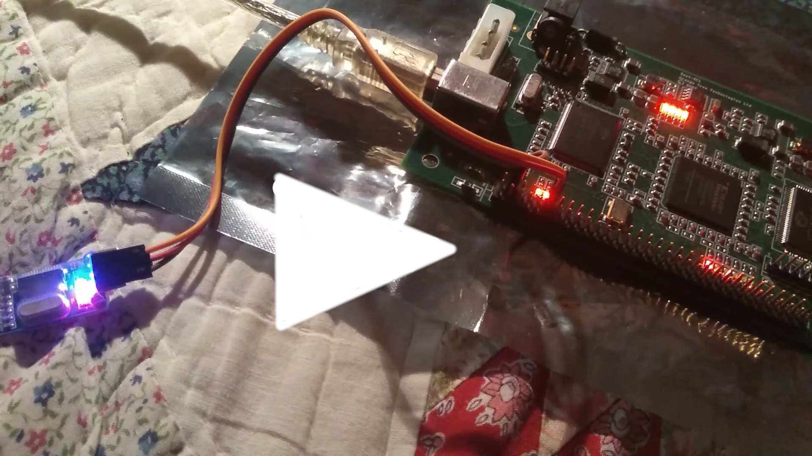
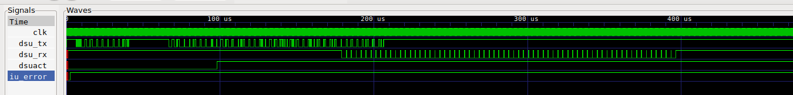

First attempt failed - the design can't fit in my FPGA board :-(

```
  The Slice Logic Distribution report is not meaningful if the design is
  over-mapped for a non-slice resource or if Placement fails.

  Number of bonded IOBs:                192 out of     173  110% (OVERMAPPED)
    IOB Flip Flops:                      85
  Number of RAMB16s:                     17 out of      24   70%
  Number of MULT18X18s:                   1 out of      24    4%
  Number of BUFGMUXs:                     5 out of       8   62%
  Number of DCMs:                         4 out of       4  100%
  Number of BSCANs:                       1 out of       1  100%

  Average Fanout of Non-Clock Nets:                3.57
```

(sigh)

I guess I'll try again at some point in the future, with a Leon2 - or a RISC-V Lite.

**UPDATE**: Setting `CFG_GRGPIO_ENABLE` to 0 (disabling Leon's GPIO) dropped the IOBs
to 174. I am just over the limit of 173 - ARGH.

**UPDATE**: I get it now - the IOBs are exhausted because of "ghost" IO entries for
the 'data' bus. Me=idiot - all this time I thought the leon3mp component's 
memory-related signals were something the 'daddy' component would connect;
instead, these are meant to be connected over the UCF file. Kind of violating
the SW engineer's principles here - "global" (.ucf-based) connections instead of
letting the user of `leon3mp` decide how to connect things.

That's my excuse, anyway :-)

Time to properly connect my SRAM. Feeling optimistic.

**UPDATE**: Slight detour: Waiting for a complete S/P/R every time I want to try
something is not an option... I need to set a proper simulation-first workflow.
But when I tried `make ghdl`...  it failed for the `unisim` parts - somehow,
the generated `make.ghdl` is missing their processing.

After a lot of huffing and puffing, I managed to fix this - by patching the
`make.ghdl` file that Jiri's scripts create, to delegate the `unisim` parts to a
[smaller Makefile of my own](https://github.com/ttsiodras/grlib-gpl/blob/7cdc7edb29f878da9d754847488a4e0431acd7eb/designs/leon3-minimal/make.unisim).
That one processes VHDL files from the ISE's `src` folder, as well as the
`libraries` folder of GHDL (which was added as a submodule to this repo).

And indeed, I can now simulate one of the Spartan3 samples:

    $ cd designs/leon3-digilent-xc3s1000
    $ make -f Makefile.ttsiod-ghdl
    ...
    ./testbench --assert-level=error --ieee-asserts=disable
    LEON3 Digilent XC3S1000 Demonstration design
    GRLIB Version 2017.3.0, build 4208
    Target technology: spartan3  , memory library: spartan3  
    ahbctrl: AHB arbiter/multiplexer rev 1
    ahbctrl: Common I/O area disabled
    ahbctrl: AHB masters: 2, AHB slaves: 8
    ahbctrl: Configuration area at 0xfffff000, 4 kbyte
    ahbctrl: mst0: Cobham Gaisler          LEON3 SPARC V8 Processor       
    ahbctrl: mst1: Cobham Gaisler          JTAG Debug Link                
    ahbctrl: slv0: European Space Agency   LEON2 Memory Controller        
    ahbctrl:       memory at 0x40000000, size 1024 Mbyte, cacheable, prefetch
    ahbctrl: slv1: Cobham Gaisler          AHB/APB Bridge                 
    ahbctrl:       memory at 0x80000000, size 1 Mbyte
    ahbctrl: slv2: Cobham Gaisler          LEON3 Debug Support Unit       
    ahbctrl:       memory at 0x90000000, size 256 Mbyte
    ahbctrl: slv4: Cobham Gaisler          Test report module             
    ahbctrl:       memory at 0x20000000, size 1 Mbyte
    ahbctrl: slv6: Cobham Gaisler          Generic AHB ROM                
    ahbctrl:       memory at 0x00000000, size 1 Mbyte, cacheable, prefetch
    apbctrl: APB Bridge at 0x80000000 rev 1
    apbctrl: slv0: European Space Agency   LEON2 Memory Controller        
    apbctrl:       I/O ports at 0x80000000, size 256 byte 
    apbctrl: slv1: Cobham Gaisler          Generic UART                   
    apbctrl:       I/O ports at 0x80000100, size 256 byte 
    apbctrl: slv2: Cobham Gaisler          Multi-processor Interrupt Ctrl.
    apbctrl:       I/O ports at 0x80000200, size 256 byte 
    apbctrl: slv3: Cobham Gaisler          Modular Timer Unit             
    apbctrl:       I/O ports at 0x80000300, size 256 byte 
    apbctrl: slv5: Cobham Gaisler          PS2 interface                  
    apbctrl:       I/O ports at 0x80000500, size 256 byte 
    apbctrl: slv6: Cobham Gaisler          VGA controller                 
    apbctrl:       I/O ports at 0x80000600, size 256 byte 
    apbctrl: slv8: Cobham Gaisler          General Purpose I/O port       
    apbctrl:       I/O ports at 0x80000800, size 256 byte 
    testmod4: Test report module
    grgpio8: 18-bit GPIO Unit rev 3
    apbvga6: APB VGA module rev 0
    apbps2_5: APB PS2 interface rev 2, irq 5
    gptimer3: Timer Unit rev 1, 8-bit scaler, 2 32-bit timers, irq 8
    irqmp: Multi-processor Interrupt Controller rev 4, #cpu 1, eirq 0
    apbuart1: Generic UART rev 1, fifo 4, irq 2, scaler bits 12
    ahbjtag AHB Debug JTAG rev 1
    dsu3_2: LEON3 Debug support unit + AHB Trace Buffer, 2 kbytes
    leon3_0: LEON3 SPARC V8 processor rev 3: iuft: 0, fpft: 0, cacheft: 0
    leon3_0: icache 1*8 kbyte, dcache 1*8 kbyte
    clkgen_spartan3e: spartan3/e sdram/pci clock generator, version 1
    clkgen_spartan3e: Frequency 50000 KHz, DCM divisor 4/5
    ahbrom6: 32-bit AHB ROM Module,  108 words, 7 address bits
    
    **** GRLIB system test starting ****
    Basic memory test
    subtest 1
    subtest 2
    subtest 3
    subtest 4
    LEON3 SPARC V8 Processor       
      CPU#0 register file
      CPU#0 multiplier
      CPU#0 radix-2 divider
      CPU#0 cache system
    Multi-processor Interrupt Ctrl.
    Modular Timer Unit             
      timer 1
      timer 2
      chain mode
    Generic UART                   
    Test passed, halting with IU error mode
    
    testbench.vhd:126:6:@1167615ns:(assertion failure): *** IU in error mode, simulation halted ***

So I now have an optimal workflow to test my ZestSC1 work via GHDL *before* I do
anything on the real board.

**UPDATE**: Concluded for this weekend. I learned a lot - making GHDL work was key.
In the end, I setup AHBRAM (BlockRAM) for my ZestSC1 (figuring out SRAM turned
out to be more difficult than I expected, due to tri-states) - and ended up
on this point:

    $ cd grlib-gpl/designs/leon3-zestsc1-xc3s1000
    $ make  -f Makefile.ttsiod-ghdl 
    
...or, after the first build - for very fast TB testing:

    $ make  -f Makefile.ttsiod-ghdl fast

Which gives this:

    Resetting for 40 cycles
    LEON3 Digilent XC3S1000 Demonstration design
    GRLIB Version 2017.3.0, build 4208
    Target technology: spartan3  , memory library: spartan3  
    ahbctrl: AHB arbiter/multiplexer rev 1
    ahbctrl: Common I/O area disabled
    ahbctrl: AHB masters: 2, AHB slaves: 8
    ahbctrl: Configuration area at 0xfffff000, 4 kbyte
    ahbctrl: mst0: Cobham Gaisler          LEON3 SPARC V8 Processor       
    ahbctrl: mst1: Cobham Gaisler          AHB Debug UART                 
    ahbctrl: slv1: Cobham Gaisler          AHB/APB Bridge                 
    ahbctrl:       memory at 0x80000000, size 1 Mbyte
    ahbctrl: slv2: Cobham Gaisler          LEON3 Debug Support Unit       
    ahbctrl:       memory at 0x90000000, size 256 Mbyte
    ahbctrl: slv3: Cobham Gaisler          Single-port AHB SRAM module    
    ahbctrl:       memory at 0xa0000000, size 1 Mbyte, cacheable, prefetch
    ahbctrl: slv4: Cobham Gaisler          Test report module             
    ahbctrl:       memory at 0x20000000, size 1 Mbyte
    apbctrl: APB Bridge at 0x80000000 rev 1
    apbctrl: slv2: Cobham Gaisler          Multi-processor Interrupt Ctrl.
    apbctrl:       I/O ports at 0x80000200, size 256 byte 
    apbctrl: slv3: Cobham Gaisler          Modular Timer Unit             
    apbctrl:       I/O ports at 0x80000300, size 256 byte 
    apbctrl: slv4: Cobham Gaisler          AHB Debug UART                 
    apbctrl:       I/O ports at 0x80000700, size 256 byte 
    testmod4: Test report module
    ahbram3: AHB SRAM Module rev 1, 16 kbytes
    gptimer3: Timer Unit rev 1, 8-bit scaler, 2 32-bit timers, irq 8
    irqmp: Multi-processor Interrupt Controller rev 4, #cpu 1, eirq 0
    ahbuart4: AHB Debug UART rev 0
    dsu3_2: LEON3 Debug support unit + AHB Trace Buffer, 2 kbytes
    leon3_0: LEON3 SPARC V8 processor rev 3: iuft: 0, fpft: 0, cacheft: 0
    leon3_0: icache 1*8 kbyte, dcache 1*8 kbyte
    clkgen_spartan3e: spartan3/e sdram/pci clock generator, version 1
    clkgen_spartan3e: Frequency 48000 KHz, DCM divisor 2/4
    Reset complete.

So in theory, everything should work on my board... alas, grmon doesn't 
see it. I launch as follows:

    $ /path/to/grmon3 -uart /dev/ttyUSB0 -freq 48 -u

...and tried using 48MHz since that's what my board runs at. Then again, the...

    constant CFG_CLKMUL : integer := (2);
    constant CFG_CLKDIV : integer := (4);

...could mean that I should run at 24MHz? Tried that too - no luck; and
without any `-freq` either (in case it could be autodetected).

So I join the armies of the *"But it works in simulation!"* people :-)

Oh well, I learned a lot at least.

Here are the Xilinx Webpack ISE reports:

- [synthesis](TheBigLeonski.srp),
- [mapping](TheBigLeonski.mrp) and
- [placement and routing](TheBigLeonski.par) and
- [timing](TheBigLeonski.twr).

All constraints met... the maximum frequency is far above the 24MHz
I asked for (via `CFG_CLKMUL/DIV`):

    Design statistics:
       Minimum period:  28.164ns{1}   (Maximum frequency:  35.506MHz)
       Minimum input required time before clock:   5.178ns
       Minimum output required time after clock:   6.676ns

I also gave my code on the PC the ability to
[reset the board](https://github.com/ttsiodras/grlib-gpl/blob/master/designs/leon3-zestsc1-xc3s1000/TheBigLeonski.vhd#L304)
over the USB bus - and verified the commands get there, by hooking this
up to one of the board LEDs - as I did for the UART TX, which can be
seen flashing the moment grmon tries to connect over UART in the
video shown below (just click on the image):

[](https://drive.google.com/open?id=1gLzqmvmTQcRpCRPtwAekiSrse7h4pfPa)

**UPDATE**: To see if the DSU responds under simulation, I added code 
in the testbench that 'speaks' to it - and indeed, after recording...

    $ make  -f Makefile.ttsiod-ghdl fastvcd
    ...
    $ zcat data.vcd.gz | gtkwave --vcd



As far as I can tell, this shows my Leon3...

- raising an IU error shortly after reset; which I believe is normal, since there's no ROM there, and the tiny BlockRAM is also empty of valid code.

- Then the testbench starts speaking to the DSU over `dsu_tx`, and the DSU seems to respond after a bit; first by raising `dsuact` (which is internally mapped to `dsuo.active`) - and then by starting to speak over `dsu_rx`.

Not that I speak the DSU protocol or anything; but this seems to indicate that at least my design isn't "dead"; the DSU is responsive. Why my grmon can't speak to it in real life, is still a mystery.

**UPDATE**: Success, sort of! Since the DSU is alive and beating, I realized that perhaps grmon is NOT sending the same data that the testbench is; so I recorded the data sent over the serial by grmon and they were indeed different!

So I instead created a file with the [50 bytes sent by the testbench](testbench.vhd#L134) until that first `wait` in the testbench *(this scenario was copied from the fully operational (under GHDL) leon3-digilent-xc3s1000 testbench)*. 

I tried sending this data directly to the board...

    $ grmon -uart /dev/ttyUSB
    ...
    Ctrl-C 
    # This leaves the UART setup the right way - baud rate, etc

    $ cat designs/leon3-zestsc1-xc3s1000/speak.to.DSU.data > /dev/ttyUSB0

...and indeed, just as in the simulation, the `dsuact` woke up - its LED lit up!

We therefore *are* able to speak to the DSU, it's just that grmon doesn't say the right magic words to wake it up!

(facepalm)

Could it be that the change to grmon3 introduced some sort of regression that doesn't allow grmon to interoperate well over UART?

**UPDATE**: IT WORKS!!! IT WORKS!!!

It would have worked from the get-go, had it not been for my desire to debug the UART traffic via LEDs - for some reason that currently eludes me, using the UART RX signal sent from the Leon3 back into BOTH the UART **and** a LED, messed things up. The moment I removed this connection, grmon saw my design.

Oh my God - I "compiled" my own CPU!

The neighbours probably got worried from my scream of pure Joy...

Victory!  :-)

[](https://drive.google.com/open?id=13J2ZKE6PlnomnE3vvsbwIWQYlRcjLYpY)

**UPDATE**: And here's a session on the final version of the design (BlockRAM placed at 0x40000000, and frequency set at 34MHz).
The relevant code is under the "contrib" folder at the root of the repo.

    $ cd contrib
    $ cat example_program.c

    int main()
    {
        unsigned *p = (unsigned *)0x40000000;
        *p = 0xDEADBEEF;
    }

    $ # Use whatever cross-compiler you fancy; I used an old version of BCC
    $ sparc-elf-gcc -Os example_program.c 

    $ sparc-elf-size a.out 
       text    data     bss     dec     hex filename
      13280    2796    1036   17112    42d8 a.out

We fit in my Block-RAM based 16KB! 
Barely :-)

    $ /opt/grmon-eval-3.0.15/linux/bin64/grmon -uart /dev/ttyUSB0 

        GRMON LEON debug monitor v3.0.15 64-bit eval version

        Copyright (C) 2019 Cobham Gaisler - All rights reserved.
        For latest updates, go to http://www.gaisler.com/
        Comments or bug-reports to support@gaisler.com

        This eval version will expire on 28/08/2019

        using port /dev/ttyUSB0 @ 115200 baud

        GRLIB build version: 4208
        Detected frequency:  34.0 MHz

        Component                            Vendor
        LEON3 SPARC V8 Processor             Cobham Gaisler
        AHB Debug UART                       Cobham Gaisler
        AHB/APB Bridge                       Cobham Gaisler
        LEON3 Debug Support Unit             Cobham Gaisler
        Single-port AHB SRAM module          Cobham Gaisler
        Multi-processor Interrupt Ctrl.      Cobham Gaisler
        Modular Timer Unit                   Cobham Gaisler

        Use command 'info sys' to print a detailed report of attached cores

      grmon3> load a.out 
        40000000 .text                     13.0kB /  13.0kB   [===============>] 100%
        400033E0 .data                      2.7kB /   2.7kB   [===============>] 100%
        Total size: 15.70kB (124.02kbit/s)
        Entry point 0x40000000
        Image /home/ttsiod/Github/grlib-gpl/contrib/a.out loaded

      grmon3> run
        Program exited normally.

      grmon3> mem 0x40000000
        0x40000000  deadbeef  00000000  00000000  00000000    ................

There - it works :-)
